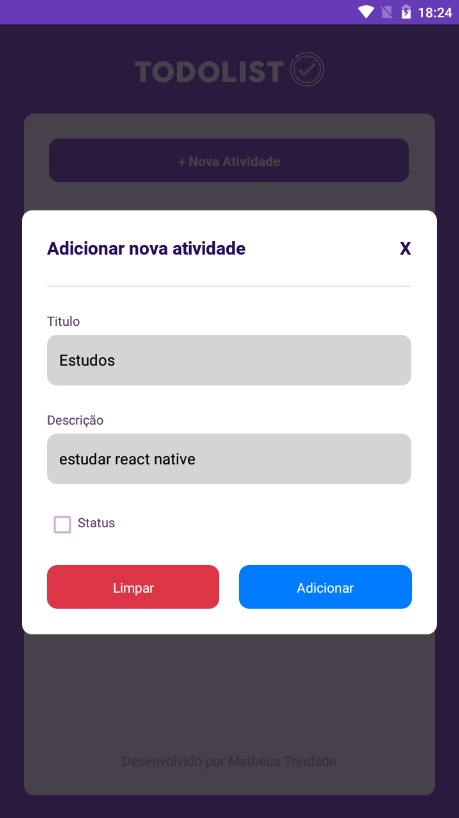
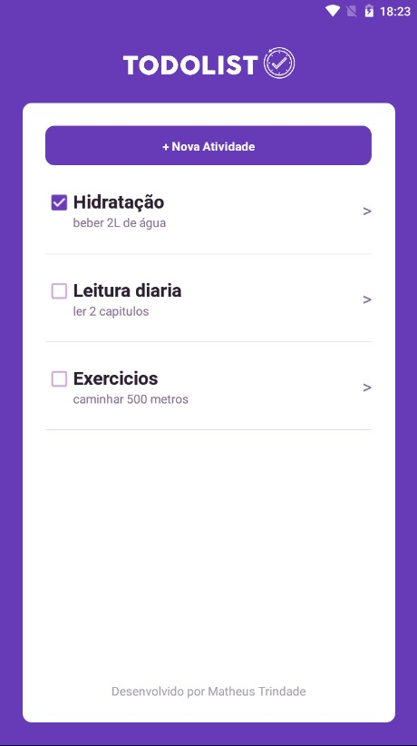
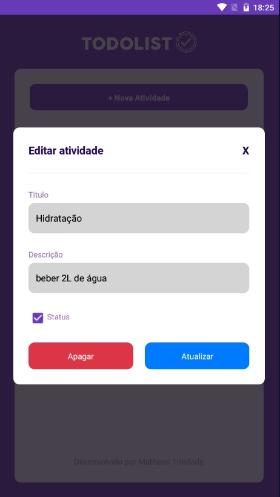

 

    

  <h3 align="center">TODO-LIST OFFLINE-FIST</h3>

  

    Um simples aplicativo ToDo utilizando WatermelonDB
     
  

  

 

## Sobre o projeto
Este projeto foi criado com intuito de aprender mais sobre a utilização de um banco de dados local, afim de iniciar os estudos sobre `Offline first` onde a biblioteca utilizada foi a `WatermelonDB` que é uma das mais utilizadas para este fim.

 

> Baseado em [Ng ToDo List](https://github.com/Thauan/ng-todo-list)

 

## Download da aplicação
* Em breve

 

##  Funcionalidades
- 📃 Listagem de Tasks
- 📑 Adicionar novas Tasks
- 📝 Editar dados das Tasks
- 💥 Deletar task

 

## Principais tecnologias

- [React Native](https://reactnative.dev/): Gerador de aplicações nativas com React
- [WatermelonDB](https://nozbe.github.io/WatermelonDB/index.html): Banco de dados utilizando a memoria do dispositvio
- [Extended StyleSheet](https://github.com/vitalets/react-native-extended-stylesheet): Estilização do aplicativo de forma responsiva

 

---

 

Feito com <b>♥</b> por <b>Matheus Trindade</b> diretamente de <b>Salvador-BA</b>

  <a href="https://twitter.com/trnddev">Twitter</a> •
  <a href="https://www.linkedin.com/in/trindadematheus/">Linkedin</a> •
  <a href="https://matheustrindade.dev.br/">Site</a>

